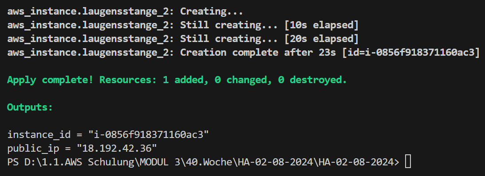
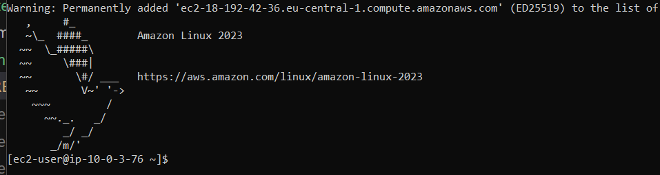
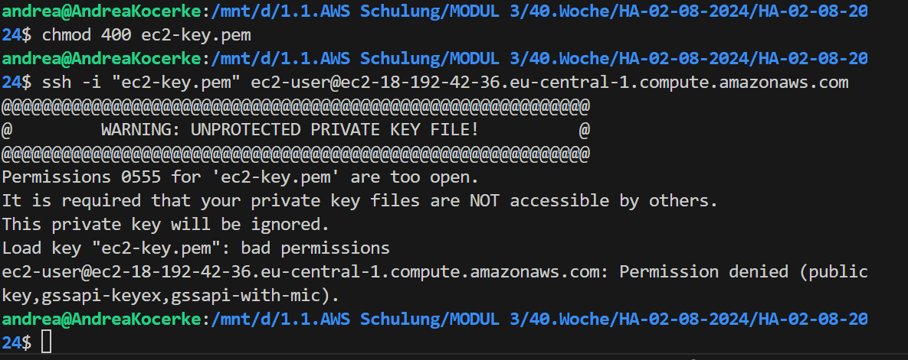
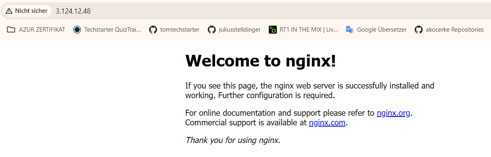

# HA-02-08-2024
wir üben noch
---
# Aufgabe 1: Ansible anwenden
Abgabe: Commit
1.1 Erstellt euch eine EC2 anhand des von euch entwickelten Terraform Skripts

✅✅✅✅✅works

# 1.2 Anhand des angehängten Commits und mit Hilfe der Folien, wendet das nginx-playbook an 

Theorie ist bissl anders wie die Praxis
viel Zeit damit verbracht das zu insatllieren via ansible github action
nix funzt

local schon garnicht hinbekommen siehe screenshots

💩

# Zusatzufgabe 2: Ansible anwenden
Abgabe: Commit

In dem Commit findet ihr ein weiteres Playbook Beispiel zu Docker. Versucht dieses anzuwenden.

Ich wünsche euch ein wunderschönes Wochenende und Ende nächster Woche noch schönere und erholsamere Ferien. Wir sehen und hören uns spätesten Ende August.